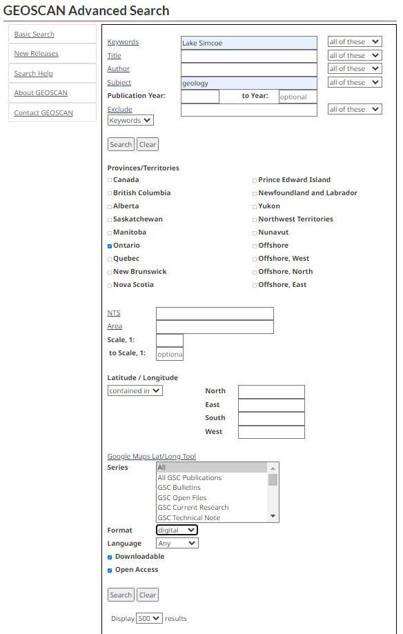
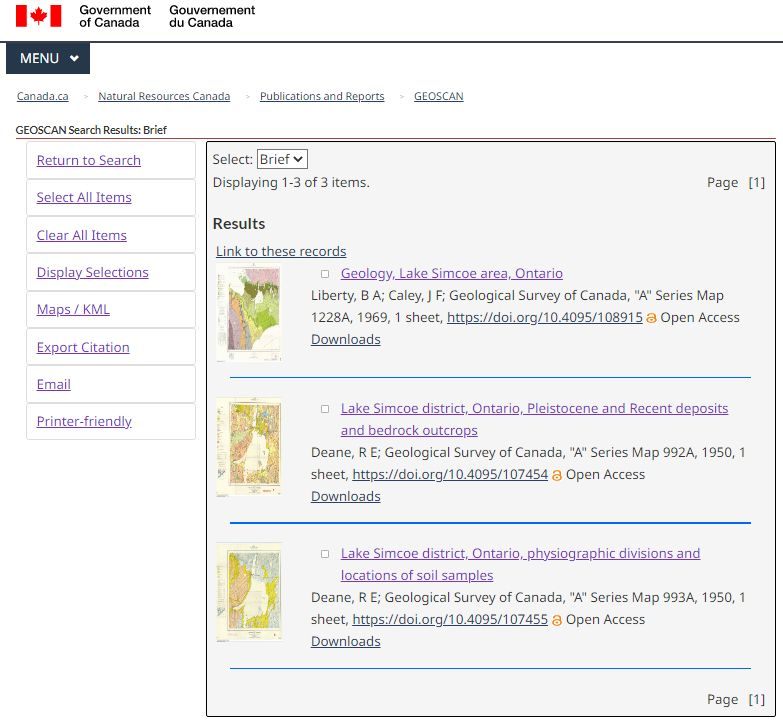
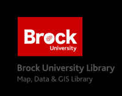

# Geological Survey of Canada (GSC) Maps & Data
This brief tutorial outlines a search and retrieval procedure for GSC maps and data using GeoScan Advanced Search.

### Searching
1. Go to [http://geoscan.nrcan.gc.ca/geoscan-index.html](http://geoscan.nrcan.gc.ca/geoscan-index.html) 
2. Select *English* then click the *Advanced Search* option.
3. Enter a geographic keyword such as "Lake Simcoe"
4. Click *subject* to browse the subject listing or enter a subject keyword such as "geology"
5. Check the box beside the province of interest.
6. From the Series list, select *GSC A-Series maps (geology)*  
7. Beside Format, select *Digital*
8. Check the box for content *with online images*
9. Click **Search**

      
    
10. Browse the results for a suitable map and click on the title for the map.
11. Click *Downloads* to access download options.

      
    

 
 
 
---
  
 
This tutorial is brought to you by the [Brock University Map, Data & GIS Library](https://brocku.ca/library/mdgl/)  E-mail us at [maplib@brocku.ca](mailto:maplib@brocku.ca)
  
You can also find us on:  
[Facebook](https://www.facebook.com/Brock-University-Map-Data-GIS-Library-107927255178257)  
[Twitter](https://twitter.com/BrockU_MDGL)  
[Instagram](https://www.instagram.com/brockmdgl/)   
 

<!--- Please use reference style images so that it is easier to update pictures later --->

